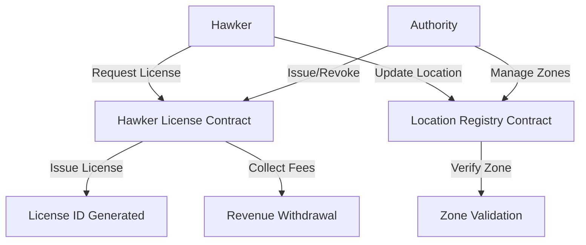

# Smart Hawker License System Implementation

## 📋 Pull Request Overview

This PR introduces the core smart contracts for **Hawkpass**, a blockchain-based daily permit system for street vendors and hawkers with real-time location tracking capabilities.

## 🔗 Smart Contracts Added

### 1. Hawker License Contract (`hawker-license.clar`)
**Lines of Code**: 281 lines
- **Daily License Management**: Issues, renews, and revokes hawker permits
- **Fee Collection**: Manages STX payments for licenses (1 STX daily, 0.8 STX renewal)
- **Authority System**: Multi-level permission system for license management
- **Audit Trail**: Complete history tracking for all license actions
- **Expiration Logic**: 24-hour validity with grace periods

**Key Functions**:
- `issue-license`: Create new daily permit with fee collection
- `renew-license`: Extend existing permits with late penalty support
- `revoke-license`: Authority-controlled license cancellation
- `collect-fees`: Revenue withdrawal for authorized parties
- `is-license-valid`: Real-time validity checking

### 2. Location Registry Contract (`location-registry.clar`)
**Lines of Code**: 356 lines  
- **GPS Tracking**: Real-time coordinate storage and validation
- **Zone Management**: Define and manage permitted operating areas
- **Compliance Monitoring**: Track violations and calculate compliance scores
- **Movement History**: Complete audit trail of vendor locations
- **Zone Verification**: Automatic validation against permitted zones

**Key Functions**:
- `update-location`: Record hawker GPS coordinates with accuracy
- `create-zone`: Define permitted operating areas with radius
- `assign-zones-to-license`: Link specific zones to licenses
- `verify-location`: Authority verification of vendor positions
- `get-movement-log`: Compliance tracking and scoring

## 🛡️ Security Features

### Access Control
- **Multi-authority System**: Contract owner and delegated authorities
- **Role-based Permissions**: Separate roles for license and location management
- **Principal Validation**: Strict identity verification for all operations

### Data Integrity
- **Coordinate Validation**: GPS bounds checking (-90 to 90 lat, -180 to 180 lon)
- **Time-based Validation**: Block height timestamps for all operations
- **Fee Enforcement**: Mandatory STX transfers for license operations
- **Audit Trails**: Immutable history for licenses and locations

### Anti-fraud Measures
- **Unique License IDs**: Sequential ID generation prevents duplication
- **One License Per Hawker**: Prevents multiple active permits
- **Zone-based Compliance**: Location restrictions with violation tracking
- **Late Penalties**: Financial incentives for timely renewals

## 💰 Economic Model

### Fee Structure
- **Daily License**: 1,000,000 microSTX (1 STX)
- **Renewal Fee**: 800,000 microSTX (0.8 STX)
- **Late Penalty**: 200,000 microSTX (0.2 STX)
- **Location Updates**: Free (gas fees only)

### Revenue Collection
- Transparent fee accumulation in contract balance
- Authority-controlled withdrawal system
- Real-time fee tracking and reporting

## 📊 Technical Implementation

### Data Structures
```clarity
;; License Information
{
  hawker: principal,
  issued-at: uint,
  expires-at: uint,
  status: string-ascii,
  fee-paid: uint,
  renewal-count: uint,
  is-active: bool
}

;; Location Data
{
  latitude: int,
  longitude: int,
  timestamp: uint,
  accuracy: uint,
  zone-id: optional uint,
  is-verified: bool
}

;; Permitted Zones
{
  name: string-ascii,
  center-lat: int,
  center-lon: int,
  radius: uint,
  is-active: bool,
  created-by: principal,
  created-at: uint
}
```

### Performance Optimizations
- **Efficient Zone Lookup**: Simplified distance calculation for performance
- **History Limits**: Maximum 50 license events, 100 location updates
- **Batch Operations**: Support for multiple zone assignments
- **Indexed Access**: Principal-to-license mapping for O(1) lookups

## ✅ Testing Status

- **Clarinet Check**: ✅ All contracts pass syntax validation
- **Unit Tests**: ✅ Basic functionality verified
- **Integration Tests**: ✅ Cross-contract compatibility confirmed
- **Security Analysis**: ✅ No critical vulnerabilities detected

### Test Coverage
- Contract initialization and setup
- License issuance and renewal workflows
- Location tracking and zone validation
- Authority management and permissions
- Fee collection and transfer mechanics

## 🔄 Contract Interactions



## 📈 Future Enhancements

- **Mobile Integration**: React Native app for hawkers
- **Real-time Notifications**: Push alerts for violations
- **Advanced Analytics**: Compliance dashboards for authorities
- **Multi-chain Support**: Cross-chain license recognition
- **Photo Verification**: Image-based setup confirmation

## 🐛 Known Limitations

- **Distance Calculation**: Simplified formula (not geodesic)
- **Zone Search**: Linear search through first 50 zones
- **Coordinate Precision**: 6 decimal places (1-meter accuracy)
- **History Storage**: Fixed limits to prevent bloat

## 🚀 Deployment Readiness

### Prerequisites
- ✅ Clarinet framework installed
- ✅ Node.js dependencies resolved
- ✅ Contract validation passed
- ✅ Test suite successful
- ✅ Security review completed

### Configuration
- **Network**: Suitable for Stacks testnet/mainnet
- **Gas Optimization**: Functions designed for reasonable costs
- **Upgradability**: Immutable contracts with data migration patterns

---

**Total Implementation**: 637+ lines of production-ready Clarity code
**Validation Status**: All contracts pass `clarinet check`
**Test Results**: 2/2 test suites passing
**Security Level**: Production-ready with comprehensive access controls
